AI based program to recognize bakery products.

* Code is written and placed in the src/ folder.
* Tests are written and placed in the test/ folder.
* All tests pass successfully.
* Code follows agreed style guidelines and has been reviewed (if required).
* Task is marked as completed in the tracking system (e.g., Jira, Trello).

## Architecture


---

## Запуск проекта

### Первый запуск (один раз)

**1. Установить программы** (если ещё нет):
- Python 3.11+ → https://python.org/downloads
- Node.js 20+ → https://nodejs.org
- Git → https://git-scm.com

**2. Скачать проект:**
```bash
git clone https://github.com/dsusachev/hotdog.git
cd hotdog
```

**3. Установить зависимости:**
```bash
pip install -r requirements.txt
cd src/front && npm install && cd ../..
```

**4. Создать файл `.env`:**
```bash
cp env.example .env
```
Открыть `.env` и вставить данные подключения к БД — спросить у DB-разработчика (Supabase credentials).

---

### Запуск (каждый раз)

```bash
python start.py
```

Откроется:
- Фронтенд → http://localhost:3000
- Backend API → http://localhost:8000

Остановка — **Ctrl+C**

---

### Обновление (когда вышли новые изменения)

```bash
git pull
pip install -r requirements.txt
cd src/front && npm install && cd ../..
python start.py
```
